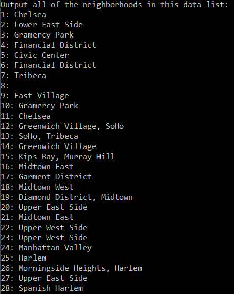
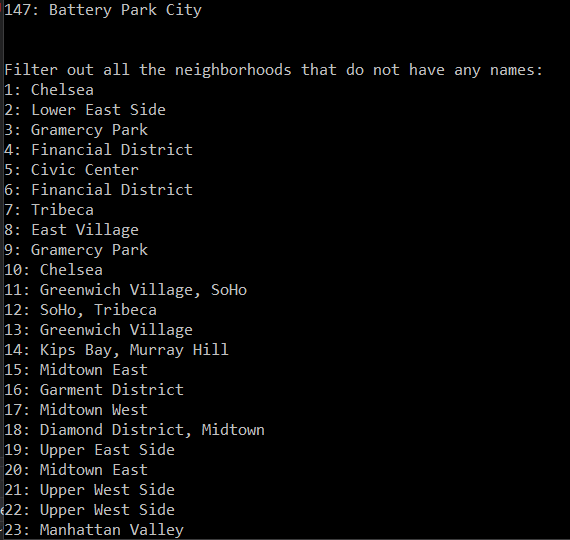
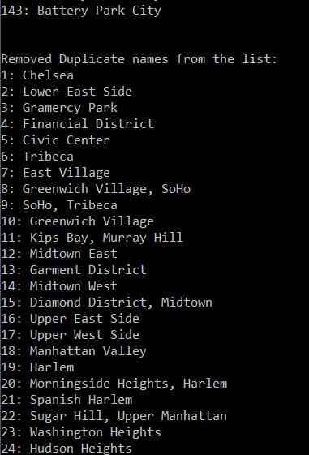
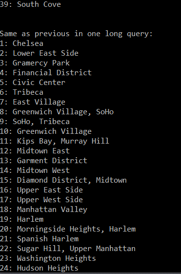
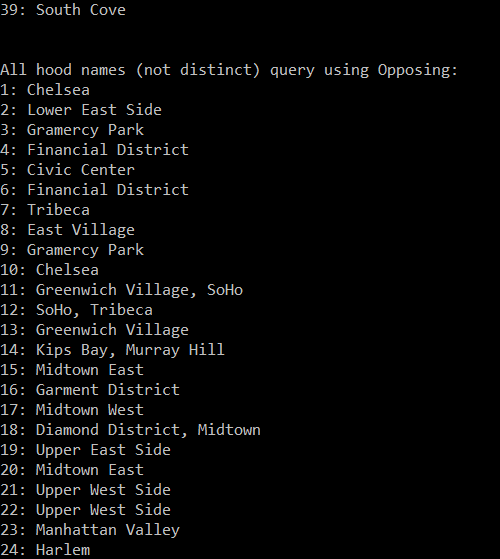

# Console Parse Manhattan Neighborhoods

Lab08-JSON-Parse

*Author: Chris Cummings*

----

## Description
This app runs through a JSON data file and filters out all the neighborhoods in the data.
There are five different queries that are run on the data, which are:

1) A query of all the neighborhoods based on the data.

2) A query of all the neighborhoods that have a name (no blanks).

3) A query of all distinct neighborhood names.

4) A query of all distinct neighborhood names again.

5) A query of all the neighborhoods that have a name (no blanks) but with a different query format.

---

### Getting Started
Clone this repository to your local machine.

```
$ git clone https://github.com/cdcummings10/Lab07--Library.git
```

### To run the program from Visual Studio:
Select ```File``` -> ```Open``` -> ```Project/Solution```

Next navigate to the location you cloned the Repository.

Double click on the ```Lab08--JSONparse``` directory.

Then select and open ```Manhattan.sln```

Click on ```Start```

### To run the executable:

Navigate to folder ```Lab08--JSONparse``` directory.

Navigate through these folders: ```Manhattan``` => ```Manhattan``` => ```bin``` => ```Debug```

Run ```Manhattan.exe```

---

### Visuals

#### First Query

#### Second Query

#### Third Query

#### Fourth Query

#### Fifth Query



---

### Time Estimates
Estimated time to finish: 4 Hours

Actual time to finish: 2.5 Hours

### Change Log 

1.0: *Finished Manhattan JSON Parse Application. Added all functionality to app.* - 24 Oct 2019
